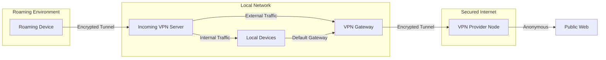
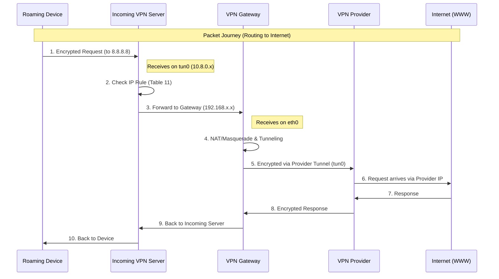
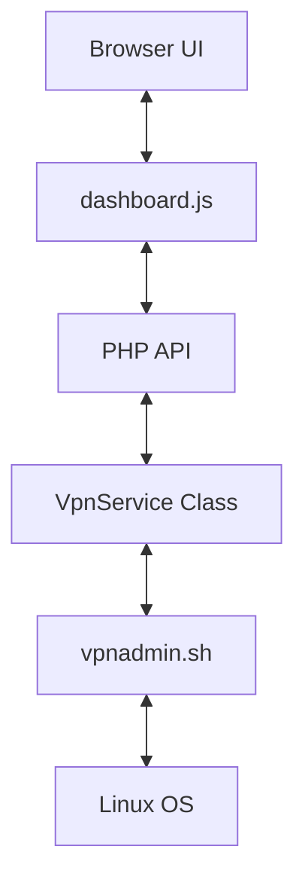

# Architecture Pipeline: Secure VPN with Local LAN

This document describes the complete architecture and data flows of the **Secure VPN with Local LAN** solution. The system is designed to provide a secure bridge between roaming devices, a local network (home/work), and a secured, anonymized internet connection.

## 1. Conceptual Overview

The system combines two functions:
1.  **Incoming VPN**: Allows devices from the outside to securely connect to the local LAN.
2.  **Outgoing VPN (Gateway)**: Sends all traffic from the local network (or specific clients) through an anonymized VPN tunnel.

---

## 2. Components & Responsibilities

### A. Incoming VPN Server (`incomingVpnServer`)
This is the entry point for roaming clients.
-   **Software**: OpenVPN or Wireguard (e.g., via PiVPN).
-   **Function**: Receives traffic from clients and forwards it based on routing rules.
-   **Magic**: Uses `up.sh` to create a specific routing table (Table 11) that forces all traffic from VPN clients to use the `VpnGateway` as the default gateway.

### B. VPN Gateway (`VpnGateway`)
The intelligence of the setup.
-   **Routing**: Acts as the default gateway for both incoming VPN clients and selected local devices (via DHCP/Dnsmasq).
-   **Web Interface**: A modern PHP dashboard for monitoring and switching VPN profiles.
-   **Automation**: `vpnadmin.sh` script for managing `iptables`, `ip rules`, and OpenVPN clients.

### C. Home Assistant Integration
Enables visualization and control from the smart home ecosystem.
-   **Sensors**: `binary_sensor` for status, IP address, and current location.
-   **Control**: `input_select` and `shell_command` to switch locations via SSH.

---

## 3. Visualization: Data & Routing Flow

The pipeline below shows how a packet from a roaming device travels to the internet through the local architecture.

---

## 4. Software Architecture (VpnGateway)

The PHP dashboard follows a modern, decoupled architecture:

-   **Security**: CSRF tokens, Bcrypt password hashing, whitelisting of arguments, and scoping via `sudoers.d`.
-   **Real-time**: The UI polls the status and logs every few seconds for a "live" experience without page refreshes.

---

## 5. Installation & Use

See individual documents for details:
-   [README.md](./README.md): General setup and iptables rules.
-   [SECURITY.md](./SECURITY.md): Essential security steps (Credentials, Sudo, HTTPS).
-   [HomeAssistant.md](./HomeAssistant.md): Integration with your smart home.
-   [dnsmasq.md](./dnsmasq.md): How to force specific LAN devices through the VPN.

---
