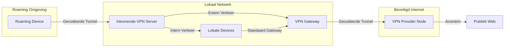
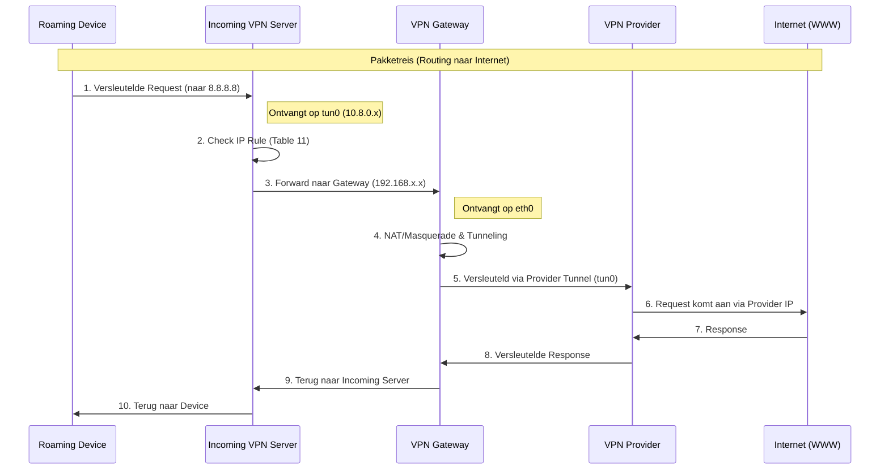
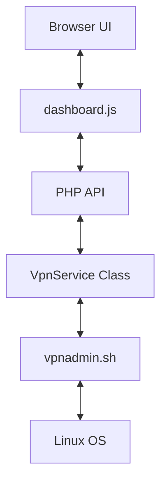

# Architectuur Pijplijn: Secure VPN with Local LAN

Dit document beschrijft de volledige architectuur en datastromen van de **Secure VPN with Local LAN** oplossing. Het systeem is ontworpen om een veilige brug te slaan tussen roaming apparaten, een lokaal netwerk (thuis/werk), en een beveiligde, geanonimiseerde internetverbinding.

## 1. Conceptueel Overzicht

Het systeem combineert twee functies:
1.  **Inkomende VPN**: Hiermee kunnen apparaten van buitenaf veilig verbinding maken met het lokale LAN.
2.  **Uitgaande VPN (Gateway)**: Verstuurt al het verkeer van het lokale netwerk (of specifieke clients) door een geanonimiseerde VPN-tunnel.

---

## 2. Componenten & Verantwoordelijkheden

### A. Inkomende VPN Server (`incomingVpnServer`)
Dit is het toegangspunt voor roaming clients.
-   **Software**: OpenVPN of Wireguard (bijv. via PiVPN).
-   **Functie**: Ontvangt verkeer van clients en stuurt dit door op basis van routeringsregels.
-   **Magie**: Gebruikt `up.sh` om een specifieke routeringstabel (Tabel 11) aan te maken die al het verkeer van VPN-clients dwingt om de `VpnGateway` als default gateway te gebruiken.

### B. VPN Gateway (`VpnGateway`)
De intelligentie van de setup.
-   **Routering**: Fungeert als de default gateway voor zowel de inkomende VPN-clients als geselecteerde lokale apparaten (via DHCP/Dnsmasq).
-   **Web Interface**: Een modern PHP-dashboard voor het monitoren en wisselen van VPN-profielen.
-   **Automatisering**: `vpnadmin.sh` script voor het beheren van `iptables`, `ip rules` en OpenVPN-clients.

### C. Home Assistant Integratie
Maakt visualisatie en bediening mogelijk vanuit het smart home ecosysteem.
-   **Sensoren**: `binary_sensor` voor status, IP-adres en huidige locatie.
-   **Bediening**: `input_select` en `shell_command` om van locatie te wisselen via SSH.

---

## 3. Visualisatie: Data & Routing Flow

De onderstaande pijplijn toont hoe een pakketje van een roaming device naar het internet reist via de lokale architectuur.

---

## 4. Software Architectuur (VpnGateway)

Het PHP-dashboard volgt een moderne, gescheiden architectuur:

-   **Veiligheid**: CSRF-tokens, Bcrypt wachtwoord-hashing, whitelisting van argumenten en scoping via `sudoers.d`.
-   **Real-time**: De UI pollt de status en logs elke paar seconden voor een "live" ervaring zonder pagina-refreshes.

---

## 5. Installatie & Gebruik

Zie de individuele documenten voor details:
-   [README.md](./README.md): Algemene setup en iptables regels.
-   [SECURITY.md](./SECURITY.md): Essentiële beveiligingsstappen (Credentials, Sudo, HTTPS).
-   [HomeAssistant.md](./HomeAssistant.md): Integratie met je smart home.
-   [dnsmasq.md](./dnsmasq.md): Hoe je specifieke LAN-devices dwingt over de VPN te gaan.

---

