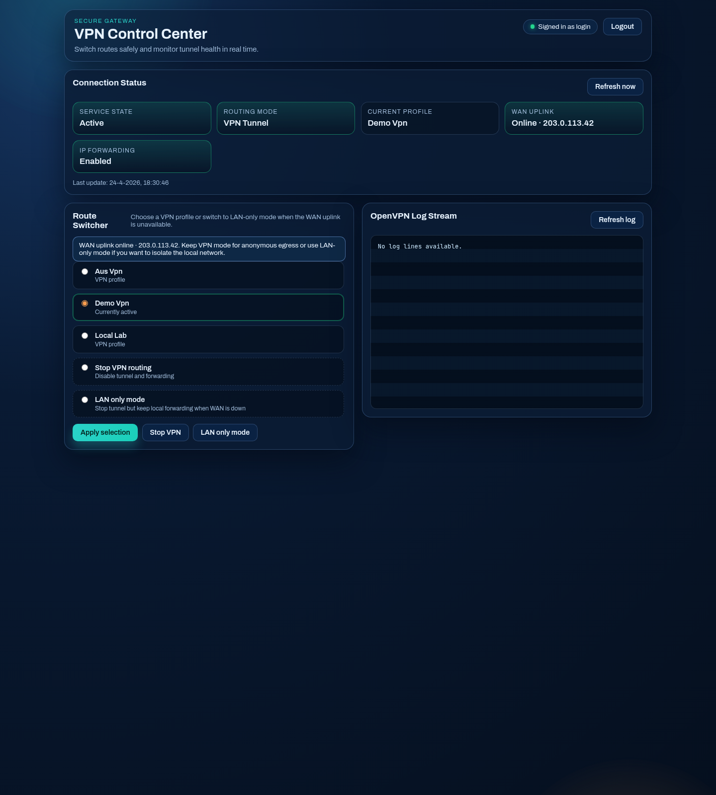

# Secure VPN With Local Lan

## Problem

On the internet a VPN can mean two things.

1. You had purchased some VPN subscription to use where ever to make a direct secure connection to an Internet Entry point where on the globe.
2. You have a vpn to your home/work location enable your local network on your roaming device.

This is Both.

This git describes and utilizes a VPN Connection to a home network with a secure VPN Connection to the internet.

Somewhere -> VPN -> Localnetwork -> VPN -> Some anonymous gateway.

## Solution

This project provides a solution for securely connecting to your home network (Local LAN) while routing all outgoing traffic through a secure VPN gateway.

For a detailed overview of what changed in this repository, see the [Changelog](./CHANGELOG.md).

> [!IMPORTANT]
> **View the Architecture Pipelines for a visual overview of the infrastructure:**
>
> - **[Architecture Pipeline (English)](./ARCHITECTURE-PIPELINE.md)**
> - **[Architectuur Pijplijn (Dutch)](./ARCHITECTUUR-PIJPLIJN.md)**

## Concept

1.  **Inbound**: Connect to your home from anywhere (Roaming).
2.  **Outbound**: Your traffic leaves your home via an anonymized VPN tunnel.

**Path**: `Roaming Device` -> `Incoming VPN` -> `Local Network` -> `VPN Gateway` -> `Anonymous Exit Node`


## Interfaces

### Web Control Center

A modern PHP dashboard to monitor status and switch between VPN profiles.


### Current UI Screenshots

The current dashboard and login flow are documented below.




Better use Home assistant to get information.


two Machines are uses to create this setup. VpnGateway and incomingVpnServer.

## Debian package installation (gateway host)

The `debianpackage` branch contains Debian packaging for host-based gateway installation.

### Build package

```bash
dpkg-buildpackage -us -uc
```

### Install package

```bash
sudo dpkg -i ../securevpn-gateway_0.3.1-1_all.deb
sudo apt-get -f install
```

### Upgrade package

Install a newer `.deb` with `dpkg -i`. Existing package conffiles are preserved by dpkg semantics unless explicitly replaced.

### Remove or purge package

```bash
sudo apt-get remove securevpn-gateway
sudo apt-get purge securevpn-gateway
```

`purge` removes package-managed policy artifacts such as `/etc/sudoers.d/vpn-gateway` but intentionally keeps operator runtime data (for example OpenVPN profile files and logs) unless removed manually.

### Installed paths (gateway package)

- Web app: `/var/www/securevpn-gateway`
- Admin wrapper: `/usr/local/bin/vpnadmin.sh`
- Rsyslog rule: `/etc/rsyslog.d/openvpn.conf`
- Docs: `/usr/share/doc/securevpn-gateway`

### Post-install behavior

Package post-install scripts prepare host runtime paths and policy integration:

- creates `/etc/openvpn/clientConfig`
- creates `/var/log/openvpn/ovpn.log`
- refreshes rsyslog when available
- enforces scoped sudoers for `www-data` to run `/usr/local/bin/vpnadmin.sh`

## Login credentials and role-based guidance

The web control center is available at http://localhost:8080 when you run the gateway container locally.

### For developers (local and test)

Default fallback credentials in code are only meant for first-run local testing:

- Username: login
- Password: pass

Use the automated local stack setup to generate your own local credentials and bring up both VPN containers:

```bash
./scripts/setup-local-vpn.sh
```

This creates `.env.local` (not committed), writes runtime tunnel configs under `.runtime/`, starts both containers, and activates the `localtest` tunnel profile.

If you need manual overrides, use environment variables:

```bash
docker rm -f securevpn-gateway-local >/dev/null 2>&1 || true

docker run -d \
   --name securevpn-gateway-local \
   -p 8080:80 \
   -e VPN_ADMIN_USERNAME=mydevuser \
   -e VPN_ADMIN_PASSWORD='Use-A-Strong-Temp-Password' \
   securevpn-gateway:local
```

### For users and operators (production)

Use a password hash in production and avoid plain-text credentials.

1. Generate a bcrypt hash:

```bash
php -r "echo password_hash('YourStrongPassword', PASSWORD_BCRYPT, ['cost' => 12]) . PHP_EOL;"
```

2. Start or update the gateway with hashed credentials:

```bash
docker rm -f securevpn-gateway-local >/dev/null 2>&1 || true

docker run -d \
   --name securevpn-gateway-local \
   -p 8080:80 \
   -e VPN_ADMIN_USERNAME=myuser \
   -e VPN_ADMIN_PASSWORD_HASH='$2y$12$replace_with_real_hash' \
   securevpn-gateway:local
```

3. Store secrets outside version control, for example in a non-committed env file.

For local production-like Docker runs, use `.env.local` with strict file permissions (`chmod 600`) and recreate containers after credential updates.

### Credential rotation

When you rotate credentials, recreate the container with new values and verify health:

```bash
docker inspect --format='{{.State.Health.Status}}' securevpn-gateway-local
```

### End-to-end VPN verification

Run the verification script after startup to confirm tunnel activation:

```bash
./scripts/verify-local-vpn.sh
```

Expected result includes:

- `ActiveState=active`
- active profile name (for example `localtest`)
- confirmation that `tun0` exists in the gateway container

### Sensitive files and ignore policy

Sensitive and runtime-generated files are intentionally ignored from version control:

- `.runtime/` (generated keys and local test configs)
- `.env` and `.env.*` (credential files)
- `*.key`, `*.pem`, `*.p12`, `*.ovpn`

Keep secrets in ignored local files only and never commit generated keys.

The routing inteligence is the following Iptable/IP rule:

```
iptables -A FORWARD -i tun0 -j ACCEPT
iptables -t nat -A POSTROUTING -o eth0 -j MASQUERADE
ip route add 10.8.0.0/24 dev tun0 table 11
ip route add default via VpnGateway dev eth0 table 11
ip rule add from 10.8.0.0/24 table 11
ip rule add to 10.8.0.0/24 table 11
```

# Setup VpnGateway

for this you require an VPN hosting using openvpn

1. place working not asking for password openvpn configurations in the folder /etc/openvpn/clientConfig

```
auth-user-pass /etc/openvpn/password.txt
```

2. install the vpnadmin.sh to /usr/bin/local and grant it passwordless sudo for the www-data user
3. copy /etc/rsyslog.d/openvpn.conf
4. install a webserver
5. copy the php site. !change the hardcoded username/password
6. systemctl enable openvpn@client.conf

now vpnadmin should work.

# Setup incomingVpnServer

1. install a openvpn server. (or wireguard) I recommend use a script like https://www.pivpn.io/
   Stop here if you want to use ip-switcher.
2. copy the up.sh script to /etc/openvpn/
3. edit the up script you your local ip settings
4. apply

```
script-security 3
up /etc/openvpn/up.sh
```

to the server.conf
